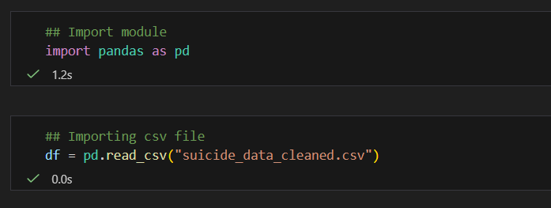
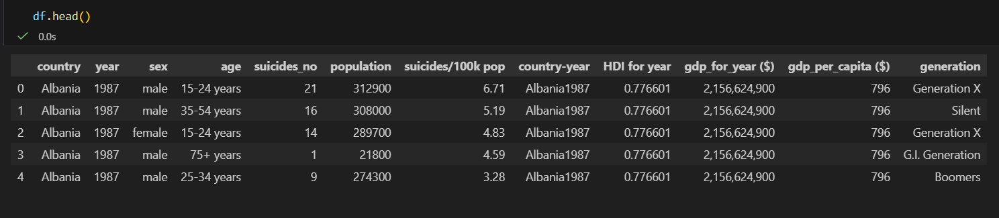
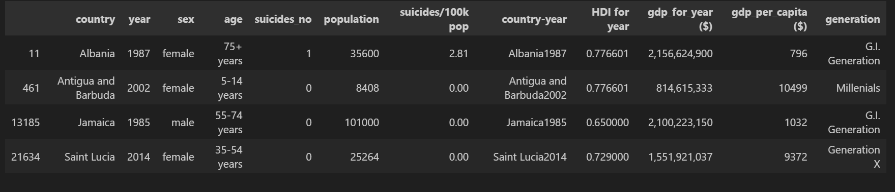
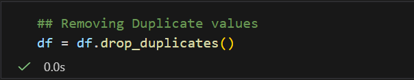
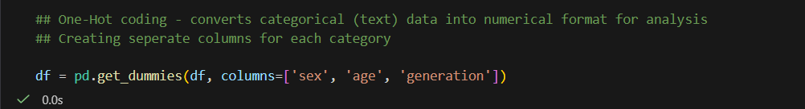
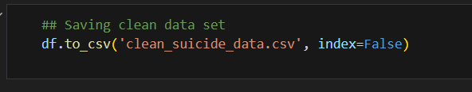

# VAUTECH IT SOLUTIONS – TASK 3

**Intern:** Abhishek Parihar  
**Intern ID:** VT26DS005  
**Domain:** Data Science
**Company:** VAUTECH IT SOLUTIONS  
**Mentor:** Vishal Rajbhar
 
**Task:** Data Loading and Initial Exploration 

---

## Objective

The objective of this task is to clean and preprocess the dataset to make it suitable for analysis. This includes handling missing values, removing duplicate records, correcting data inconsistencies, converting categorical data into numerical format, and preparing a structured, reliable dataset for further data analysis, visualization, and machine learning applications.

---

## Tools Used

- Python
- Pandas
- Jupyter Notebook / VS Code

## Dataset Information

- Dataset: Suicide Data
- Format: CSV
- Source: https://raw.githubusercontent.com/MainakRepositor/Datasets/master/Suicide%20data.csv

## Step 1: Loading the Dataset

code:
import pandas as pd
df = pd.read_csv('suicide_data.csv')

## Step 2: Preview Data
df.head()

## Step 3: Checking Duplicate values
df[df.duplicated()]

## Step 4: Removing Duplicate values
df = df.drop_duplicates()

## Step 5: Creating seperate columns for each category
df = pd.get_dummies(df, columns=['sex', 'age', 'generation'])

## Step 6:  Saving clean data set 
df.to_csv('clean_suicide_data.csv', index=False)

---

## Conclusion

In this task, the dataset was successfully cleaned and preprocessed to ensure accuracy and consistency. Missing values were handled, duplicate records were removed, inconsistencies were corrected, and categorical variables were converted into numerical format. These steps prepared a clean and structured dataset that is now ready for further data analysis, visualization, and machine learning applications.